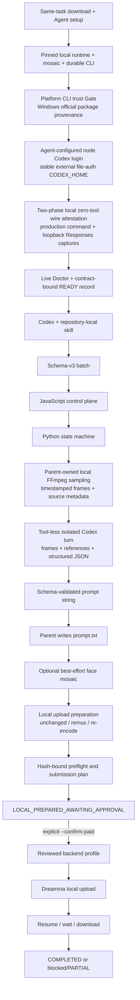

# Architecture

Video Replacer 把对话 Agent、确定性父层和远端 adapter 分开。Agent 只表达用户意图和素材绑定；确定性代码拥有状态、哈希、隐私模式、媒体准备、费用 Gate 和恢复。

## Trust boundaries

- Git repository: executable source, contracts and tests only.
- `.video-replacer/bin/dreamina`: ignored, project-local official binary installed only from the reviewed URL/SHA-256 manifest; no PATH or global-skill mutation.
- `tools/dreamina_environment.py`: the single environment constructor for install, Doctor, login/account checks and adapter calls. On Windows it resolves native system directories from Win32 APIs and gives only each Dreamina child a restricted PATH plus `NoDefaultCurrentDirectoryInExePath`, so the reviewed 1.4.15 bare-name PowerShell/CIM ancestry probe cannot enter its upstream unbounded wait. This narrowly addresses that probe; it is not a general subprocess sandbox and does not persistently change PATH.
- `~/.dreamina_cli/version.json` (Windows: `%USERPROFILE%\.dreamina_cli\version.json`): the sole Dreamina-owned file outside the repository that the installer may create. It is non-sensitive official version/update metadata, validated against the repository manifest and atomically created only when absent before the bounded real CLI version check. Existing schema-valid provider metadata is preserved; malformed, nonregular or link-like metadata fails closed. Credential files are outside this write boundary.
- Windows Codex package: the configured entrypoint must resolve into the modern canonical `packages/standalone/releases/<version>-x86_64-pc-windows-msvc/` tree. Before execution, the verifier validates its plain package layout and `codex-package.json`, fetches only `https://releases.openai.com/codex/releases/<version>/release.json`, selects the single `codex-x86_64-pc-windows-msvc.exe` asset, and matches its SHA-256 to the actual `bin/codex.exe`. Old/nonofficial layouts, exact endpoint or tag/asset/digest failures, and unavailable online provenance fail closed.
- `.video-replacer/setup.json`: ignored, non-secret profile, code-contract digest, canonical tool paths/identities, capabilities and Doctor statuses; no credentials. Windows Codex identity records the exact release's `official_sha256` and `official_release_tag`, not a permanently pinned digest. Every task-bearing workflow launch revalidates the record and runs current online checks; every live status refetches the exact-version official manifest and rehashes Windows Codex. Read-only `status` and help remain available for diagnosis before setup.
- `workspace/video-loop/`: ignored batch inputs and state-machine artifacts.
- `outputs/video-replacements/`: ignored Job outputs and downloaded videos.
- platform state directory: one resolver is shared by bootstrap, Doctor, setup and the workflow. POSIX preserves its absolute `VIDEO_REPLACER_STATE_DIR` override and XDG semantics and enforces mode `0700`. Native Windows asks the Known Folder API for the real current user's `FOLDERID_LocalAppData`, fixes the root at `LocalAppData/video-replacer`, ignores environment-supplied `LOCALAPPDATA`, and accepts `VIDEO_REPLACER_STATE_DIR` only when it canonically restates that exact root. Windows requires a local fixed drive and rejects redirects, UNC, mapped-drive, non-fixed-drive and reparse-point paths. The node-home directory, `auth.json` and `.video-replacer-auth.lock` are owned by the current user and have inheritance-protected DACLs with exactly the current-user and `SYSTEM` full-control allow ACEs; setup applies this boundary and live validation enforces it.
- node Codex home: `$VIDEO_REPLACER_STATE_DIR/codex-node-home/`, a stable external, instruction-free `CODEX_HOME` under the platform state boundary. Setup launches `[LAUNCHER, "setup", "login-codex-node"]` into this home and the user completes only the provider account authorization. The credential store is file-based and must pass the bounded strict ChatGPT file-auth schema before use; setup does not copy the outer Agent's auth on each invocation. Doctor and every production prompt turn resolve this same home. It contains no `AGENTS.md`, rules, skills, plugins, MCP configuration, hooks or other user configuration. Under the stable home lock, an explicit login may remove only a malformed regular `auth.json` after independent structure/ACL and stable file-identity checks; valid auth remains, and unsafe/link/nonregular states fail before Codex starts.
- local wire attestation: under one stable node-home lock, Doctor runs two captures with the exact production prompt command, same home, synthetic attached image and HTTP loopback Responses provider. Required check `codex-wire` sets `requires_openai_auth=false` and requires zero top-level tools, zero nested/additional tools, zero multi-agent hints and no auth/API-key header. Required check `codex-file-auth-wire` sets `requires_openai_auth=true`, requires the same zero-tool image surface plus exactly one Bearer handshake, and compares in-memory SHA-256 values with `hmac.compare_digest` to prove that Bearer equals the strictly validated stable `auth.json` `access_token`. The capture retains no raw token/header value. HTTP 418 stops each phase before inference. This tests the final local wire surface after managed/system configuration has been applied, so a reintroduced MCP, hook, tool or host-agent instruction blocks READY.
- local sampling boundary: the deterministic Python parent invokes the trusted FFmpeg identity with a credential-minimized environment and creates a bounded chronological, uniform-timestamp sample set beginning at the opening frame. It hashes every frame and fixes its timestamp before the model turn. Supported backend sources are at most 30 seconds, so the current sampling cadence is 0.75 seconds; the bounded policy also spreads samples across an unexpectedly longer source instead of exhausting them on its opening. The source video itself is not attached to the prompt node.
- Codex prompt node: one Job receives only the parent-attached sampled frames, ordered reference images and structured JSON. `CODEX_EXEC_SERVER_URL=none` keeps `execution_environment` at `none` and prevents an execution/filesystem environment from being registered; shell, patch, file-reading, permission-request and network tools are unavailable, as are skill/plugin/app/multi-Agent discovery. The model returns a structured prompt string and cannot write `prompt.txt`.
- parent-owned persistence: the Python parent validates the structured result and alone writes `prompt.txt`; a `COMPLETE` model result is still subject to lineage, prompt, upload-preparation, hash and preflight Gates.
- backend adapter: selected only through `tools/backend_profiles.py`; credentials are resolved only by the adapter that needs them.

The sampled Video-to-Prompt turn performs observation and prompt writing in one model call. It does not create an intermediate analysis artifact for a second model. All prompt-node Codex processes are serialized, including across Jobs, so a single file-auth credential store never receives concurrent refresh-token writes. On Windows, the outer repository Agent may use Codex's official `elevated` sandbox. The inner prompt process uses the stable node-only `CODEX_HOME` and `CODEX_EXEC_SERVER_URL=none`; it neither depends on an inherited sandbox execution environment nor creates a second elevated sandbox or home. The repository revalidates Windows Codex provenance immediately before launching this production process.

The two wire phases are not a model availability or output-quality probe. Each captured model request is routed to the loopback mock and rejected with HTTP 418 before any model response or inference. The authenticated phase sends one Bearer header to that local mock and immediately reduces it to a comparison digest; raw credential material is not retained or logged. Together the captures prove that the exact constructed request has the intended image-bearing zero-tool surface and uses the stable strict file-auth identity. They do not attest unrelated process network activity; the separate Doctor catalog check establishes configured model visibility.

## Upload preparation

The workflow examines the actual file that would be uploaded after optional mosaic processing.

1. Reuse a compatible file below the selected profile limit.
2. Otherwise try a lossless remux.
3. If still invalid, attempt at most three H.264/AAC two-pass encodes.
4. Verify actual bytes, profile constraints and a complete FFmpeg decode.
5. Bind the resulting file and preparation manifest by SHA-256 into preflight and paid authorization.

## Paid execution

The JavaScript control plane creates an in-memory payment capability only for an explicit paid command. It binds the batch, frozen flow, eligible Jobs, profile, final media hashes and preflight evidence. A changed input invalidates the checkpoint.

The public first-run and operator lane uses the official Dreamina CLI because its own credential store survives Agent sessions. Ark adapter code remains for internal development and tests only. Until it has a reviewed credential broker plus a trustworthy no-cost account/model probe, the public Skill, setup record and root launcher cannot select it.

## Recovery

Task fingerprints and remote task IDs are written to the external ledger before ambiguous network transitions can be retried. An uncertain submission is resumed by task ID; it is never silently recreated. Batch outcomes route to `completed/` or `blocked/`, with `PARTIAL` retained for targeted recovery.
